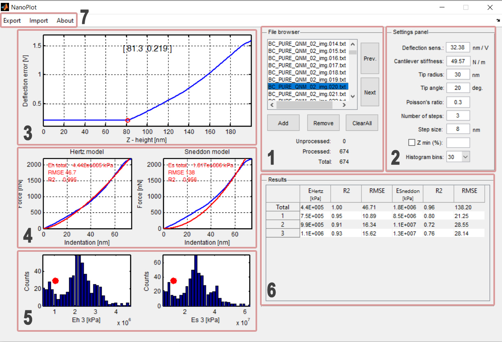

# NanoPlot v1.1 - Manual

## Introduction
This software was designed to analyze Multimode NanoScrope AFM Bruker force-distance curves calculate sample indentation depth and sample Young modulus. Young modulus is calculated using two different contact models – Hertz and Sneddon model [https://doi.org/10.1016/j.tifs.2018.04.011]. Software implements principles of AFM stiffness tomography [https://doi.org/10.1016/j.bpj.2009.05.010]. The goal was to provide robust software that enables mass data processing while viewing individual results.

## Installation
To install and run this software simply copy “NanoPlot.m” and “NanoPlot.fig” files to one folder and run “NanoPlot.m” script. Software requires at least R2011a Matlab with Curve Fitting Toolbox.

## Input data
Software accepts force curve data written as tab-delimited text files, converted from raw data files using Bruker native software (NanoScope Analysis).
The ASCII data files should contain “Calc_Ramp_Ex_nm” and “Defl_V_Ex” columns. Please ensure that your data was exported with these columns. Otherwise software will be unable to process your data.
Reading and viewing raw data
Data files are imported using UI controls from file browser section (Fig.1-1). This section enables to read new AFM data files and view data from already uploaded ones. Additional text boxes indicate total number of uploaded files, as well as number of processed and unprocessed files. (processed = data with successfully identified contact point and fitted contact model). The unprocessed files are also marked on file list with red font.

Available buttons:
**Add** - Opens dialog window enabling to select new data file. Selected files are
**Remove** - Removes currently selected file from list.
**Clear all** - Clears entire file list
**Next** - Moves to next data file.
**Previous** - Moves to previous data file.

You can also navigate through data files using keyboard up and down arrows or using mouse.
Raw data is presented on force-deformation plots (Fig.1-3). FD plots show deflection error (V) and Z – height (nm) of piezo scanner.  The scale of the displayed data can be changed with the help of the “Z min” control, that defines the minimum range of displayed data as a percentage of the maximum value of the scanner position in the Z axis.

## Contact point
Initial position of the indentation contact point is set automatically when the data file is loaded for the first time. Position of contact point is indicated by red hollow dot on FD plot. Position of contact point can be changed by clicking left mouse button on different part of data curve. Contact point can be also erased by right clicking on FD plot. Precise adjustments of the contact point position can be done by hovering mouse cursor over FD plot and moving mouse wheel. Resulting force-indentation curve is base line corrected using line fitted to data on the left side of the contact point.

## Data processing
Data processing involves FD curve sectioning, fitting contact models and calculation of sample mechanical properties (Young modulus). Data is processed only when the position of the contact point is set properly. Data is also processed when the position of contact point or values of processing parameters are changed.
Settings panel allows to enter input information required for AFM data processing (Fig.1-2). Please note that settings are globally applied to all imported FD curves. Processed FD curves should be obtained using the same probe and the same AFM settings. Any change in processing settings will result in recalculation of contact models for all uploaded files. For large data sets this may take some time.

Data processing settings are:
Deflection sens. – deflection sensitivity of AFM cantilever expressed in nm/V
Cantilever stiffness – stiffness of AFM cantilever expressed in N/m
**Tip radius** – AFM tip apex radius in nm
**Tip angle** – opening angle in degrees for pyramidal shape AFM tip
**Poisson’s ratio** – poisson’s ratio of examined sample
**Number of steps** – FD curves are analyzed in steps/sections starting from contact point to up to sections end. Section length = number of steps * step size. For example, if number of steps equals 3 and step size equals 10 nm, then three sections of FD curves are analyzed – 0 to 10 nm, 0 to 20 nm and 0 to 30 nm of indentation. Additionally, contact models are fitted to full length of indentation curve.
**Step size** – length of FD curve analysis step in nm

## Viewing results
The results are showed on force-indentation plots, Young modulus bar plots and in Young modulus data table (Fig.1-4,5,6). Force-indentation plots shows also contact models (red lines) for the whole indentation curve.
Bar plots show distribution of Young modulus values for selected section of the indentation curve. Hisotgram bins – defines number of histogram bins for Young modulus bar blots.
General data processing routine
1.	Set input values for data analysis in section [2] of user interface (Fig.2).
2.	Read data file/files.
3.	Examine imported files for any  signs of corrupted data.
4.	Adjust position of contact point for each FD curve.
5.	Save batch for further processing.
6.	Export results.

## Data export
Resulting Young modulus values can be saved to *.xlsx or *.csv files. These actions can be performed by selecting the appropriate option from the top menu (Export, Fig.2-7).

## Exporting and importing workspace
You can also save whole workspace (imported data, settings and results) into one batch file (Export -> Export batch to *.Mat file), which can be read and processed later via Import from top menu (Fig.2-7).
